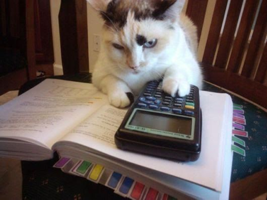
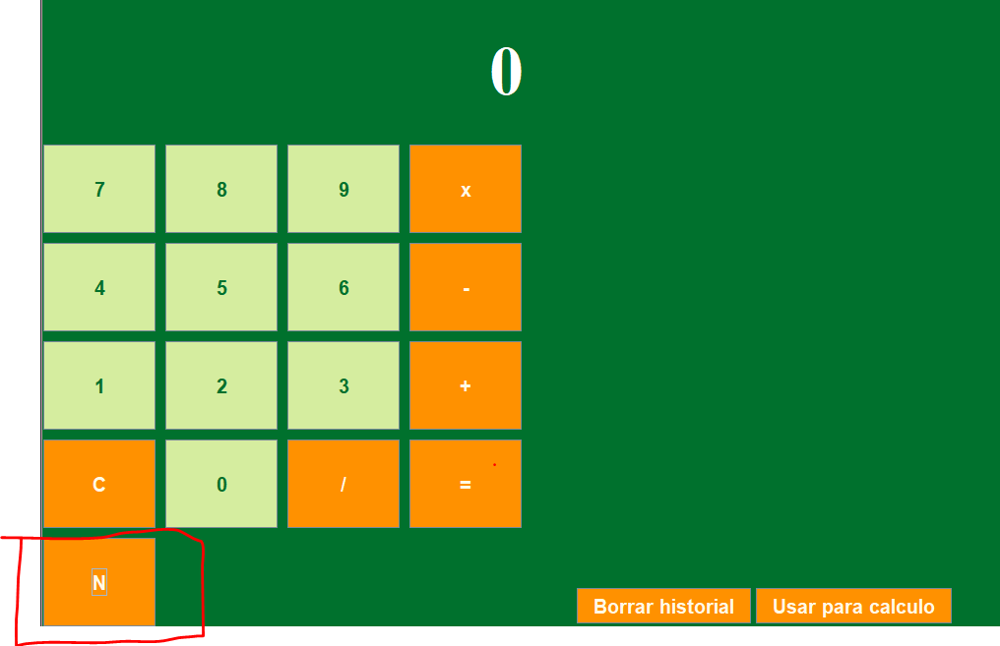

<div align="center">
  
  
  # Calculadora ☝🤓

Esta es una calculdora sencilla con un historial de operaciones.

[Descripción](#Descripción) || [Interfaz Grafica](#Interfaz-Grafica) || [Ejemplo de uso](#Ejemplo-de-uso) || [Historial de Operaciones](#Historial-de-Operaciones)

Autor : **[Oscar Nzabarinda Mukeshimana](https://github.com/MainKataVerde)**

</div>

## Lenguaje Usado

- Java

## Requisitos

- Java 11
- Maven

## Descripción

La calculadora es capaz de realizar operaciones aritméticas, sumar, restar, multiplicar y dividir.

El historial de operaciones se almacenan temporalmente en la maquina , eso quiero decir que en cuanto cierres la aplicación, se borran los datos.

#### Ejemplo de Operaciones

Aqui os mostrare un ejemplos de operaciones que la calculadora puede realizar.

```
2 ∗ (−1)
-------
(−4)/ (−4)
-------
4 − 8
-------
(−12) ∗ 7
-------
(−6) − 9
-------
(−6) − (−9)
-------
0/3
-------
(−4) + (−4)
```

# Interfaz Grafica

<div align="center">
Primero que todo un pequeño vistazo de la interfaz grafica.
<br>
<br>
  
<br>
<br>
</div>  
Como puedes ver , la calculadora tiene una paleta de colores verde y naranja , lo botones naranjas son los botones de operaciones y los botones verdes son los botones de los numeros.

En el la parte derecha tenemos un historial de operaciones , que posteriormente explicaremos mas en detalle.

### Ejemplo de uso

Aqui tenemos un ejemplo de uso de la calculadora.

<div align="center">

<br>
<br>
<hr>
Aqui tenemos un ejemplo de uso del historial de la calculadora.
<br>
<br>


#### Historial de Operaciones

Como hemos visto en el ejemplo grafico anterior , el historial de operaciones se compone de dos botones uno que como se vio borra el historial y el otro importa el resultado de la oparacion seleccionada a la calculadora.

#### Numeros negativos



En el primer ejemplo en el que usamos la calculadora se puede observa que usamos una tecla en la que pone "N" se usa para poner numero negativo , pero , ¿cómo funciona?

Su funcionamiento es sencillo , primero hay que usar poner el numero y luego decidir si queremos que sea negativo o no


# NEW VERSION

## Cambios

Ahora la calculadora tiene cambios de base , entre ellos se encuentra el hexadecimal , binario , octal y como en la antigua version el decimal , esta misma no cambio si diseño , lo que pasa es que ahora mismo tenemos que indicar en que modo queremos la calculadora . Aqui una foto de ejemplo de la nueva calculadora :


Como se puede ver en la parte superior de los numeros tenemos dos nuevas partes , la que indica las letras pertenecientes al hexadecimal y la parte en la que se pueden elegir las bases

### Copia de resultados

Con este nuevo boton nos permite copar el resultado que tenemos en el display actalmente y ponerlo en el porta papeles , displonible para comiarlo dentro de cualquier texto


</div>
